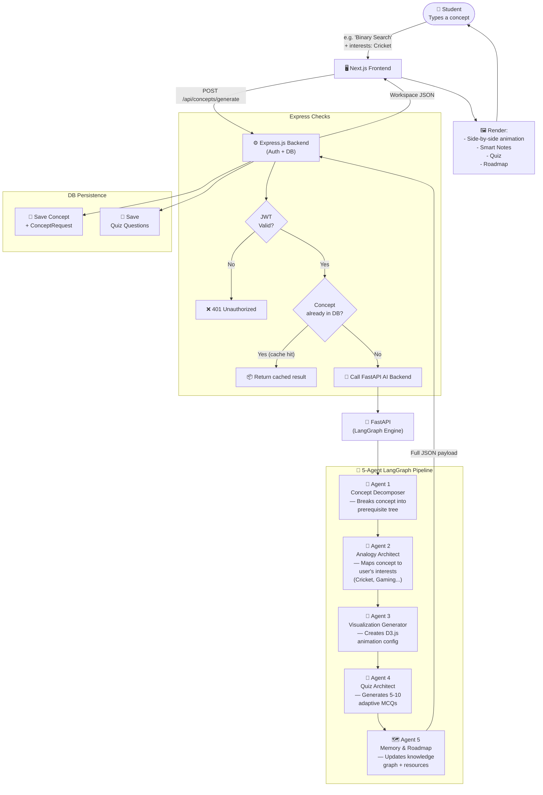
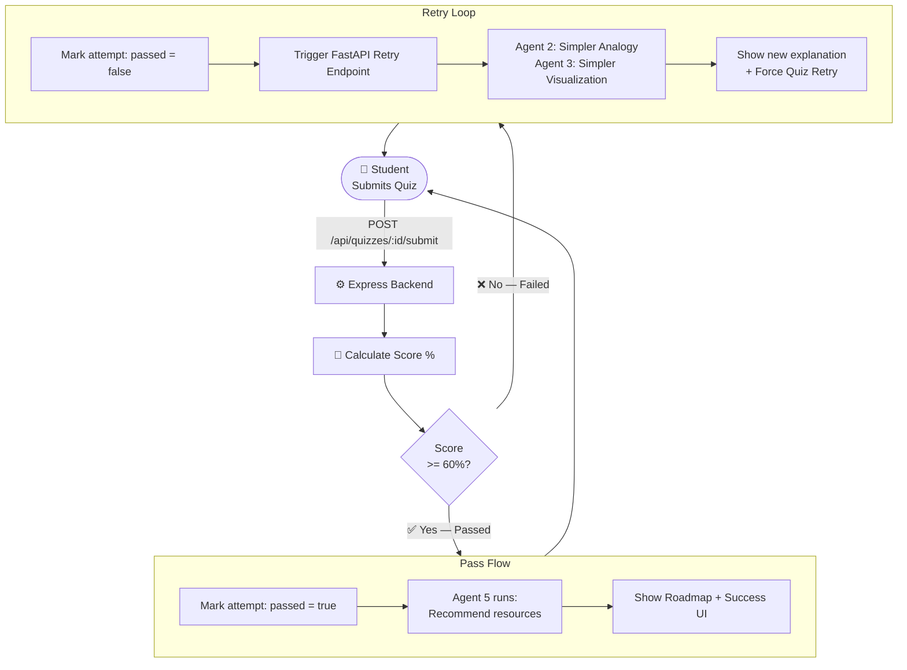
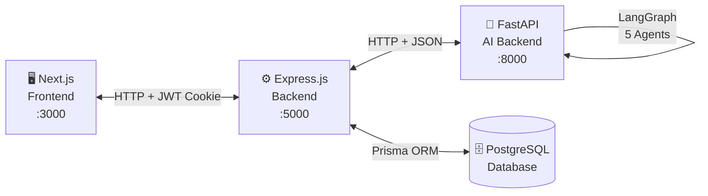

# ConceptCraft AI — Agent Workflow Diagram

## 🧠 Full 5-Agent Pipeline Flow

```mermaid
flowchart TD
    User(["👤 Student\nTypes a concept"])

    User -->|"e.g. 'Binary Search'\n+ interests: Cricket"| FE

    FE["🖥️ Next.js Frontend"]
    FE -->|"POST /api/concepts/generate"| BE

    BE["⚙️ Express.js Backend\n(Auth + DB)"]

    subgraph BE_Logic ["Express Checks"]
        BE --> JWT_Check{"JWT\nValid?"}
        JWT_Check -->|"No"| Err401["❌ 401 Unauthorized"]
        JWT_Check -->|"Yes"| Cache_Check{"Concept\nalready in DB?"}
        Cache_Check -->|"Yes (cache hit)"| ReturnCache["📦 Return cached result"]
        Cache_Check -->|"No"| CallAI
    end

    CallAI["📡 Call FastAPI AI Backend"]
    CallAI --> FA

    FA["🐍 FastAPI\n(LangGraph Engine)"]

    subgraph Pipeline ["🔁 5-Agent LangGraph Pipeline"]
        direction TB
        A1["🧩 Agent 1\nConcept Decomposer\n— Breaks concept into\nprerequisite tree"]
        A2["🎯 Agent 2\nAnalogy Architect\n— Maps concept to\nuser's interests\n(Cricket, Gaming...)"]
        A3["🎨 Agent 3\nVisualization Generator\n— Creates D3.js\nanimation config"]
        A4["📝 Agent 4\nQuiz Architect\n— Generates 5-10\nadaptive MCQs"]
        A5["🗺️ Agent 5\nMemory & Roadmap\n— Updates knowledge\ngraph + resources"]

        A1 --> A2 --> A3 --> A4 --> A5
    end

    FA --> A1
    A5 -->|"Full JSON payload"| BE

    subgraph DB_Save ["DB Persistence"]
        BE --> SaveConcept["💾 Save Concept\n+ ConceptRequest"]
        BE --> SaveQuiz["💾 Save\nQuiz Questions"]
    end

    BE -->|"Workspace JSON"| FE

    FE --> Render["🖼️ Render:\n- Side-by-side animation\n- Smart Notes\n- Quiz\n- Roadmap"]

    Render --> User
```

---

## 🔁 Quiz Retry Loop (Score < 60%)

```mermaid
flowchart TD
    UserQuiz(["👤 Student\nSubmits Quiz"])

    UserQuiz -->|"POST /api/quizzes/:id/submit"| BE["⚙️ Express Backend"]
    BE --> ScoreCalc["🧮 Calculate Score %"]
    ScoreCalc --> Check{"Score\n>= 60%?"}

    Check -->|"✅ Yes — Passed"| PassPath
    Check -->|"❌ No — Failed"| FailPath

    subgraph PassPath ["Pass Flow"]
        P1["Mark attempt: passed = true"]
        P2["Agent 5 runs:\nRecommend resources"]
        P3["Show Roadmap + Success UI"]
        P1 --> P2 --> P3
    end

    subgraph FailPath ["Retry Loop"]
        F1["Mark attempt: passed = false"]
        F2["Trigger FastAPI Retry Endpoint"]
        F3["Agent 2: Simpler Analogy\nAgent 3: Simpler Visualization"]
        F4["Show new explanation\n+ Force Quiz Retry"]
        F1 --> F2 --> F3 --> F4
    end

    PassPath --> UserQuiz
    FailPath --> UserQuiz
```

---

## 📊 System Architecture (Bird's Eye View)

```mermaid
graph LR
    FE["🖥️ Next.js\nFrontend\n:3000"]
    BE["⚙️ Express.js\nBackend\n:5000"]
    AI["🐍 FastAPI\nAI Backend\n:8000"]
    DB[("🗄️ PostgreSQL\nDatabase")]

    FE <-->|"HTTP + JWT Cookie"| BE
    BE <-->|"HTTP + JSON"| AI
    BE <-->|"Prisma ORM"| DB
    AI -->|"LangGraph\n5 Agents"| AI
```
