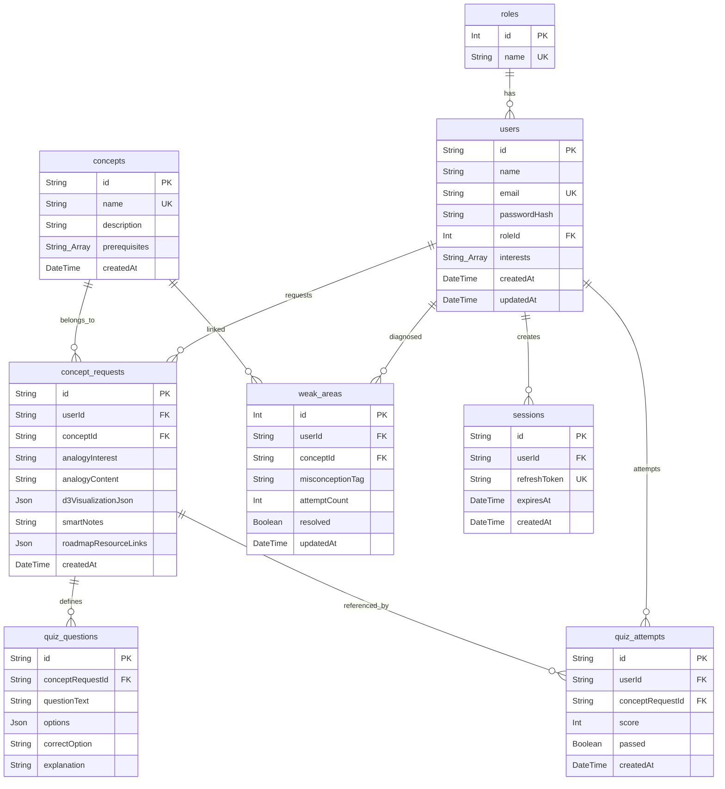

# Entity-Relationship Diagram (ERD) - Prisma Models

Press **`Ctrl + Shift + V`** (Windows/Linux) or **`Cmd + Shift + V`** (Mac) to view this diagram visually inside your editor.

```mermaid
erDiagram
    users {
        String id PK
        String name
        String email UK
        String passwordHash
        Int roleId FK
        String_Array interests
        DateTime createdAt
        DateTime updatedAt
    }

    roles {
        Int id PK
        String name UK
    }

    concepts {
        String id PK
        String name UK
        String description
        String_Array prerequisites
        DateTime createdAt
    }

    concept_requests {
        String id PK
        String userId FK
        String conceptId FK
        String analogyInterest
        String analogyContent
        Json d3VisualizationJson
        String smartNotes
        Json roadmapResourceLinks
        DateTime createdAt
    }

    quiz_questions {
        String id PK
        String conceptRequestId FK
        String questionText
        Json options
        String correctOption
        String explanation
    }

    quiz_attempts {
        String id PK
        String userId FK
        String conceptRequestId FK
        Int score
        Boolean passed
        DateTime createdAt
    }

    weak_areas {
        Int id PK
        String userId FK
        String conceptId FK
        String misconceptionTag
        Int attemptCount
        Boolean resolved
        DateTime updatedAt
    }

    sessions {
        String id PK
        String userId FK
        String refreshToken UK
        DateTime expiresAt
        DateTime createdAt
    }

    roles ||--o{ users : "has"
    users ||--o{ concept_requests : "requests"
    concepts ||--o{ concept_requests : "belongs_to"
    concept_requests ||--o{ quiz_questions : "defines"
    users ||--o{ quiz_attempts : "attempts"
    concept_requests ||--o{ quiz_attempts : "referenced_by"
    users ||--o{ weak_areas : "diagnosed"
    concepts ||--o{ weak_areas : "linked"
    users ||--o{ sessions : "creates"
```
